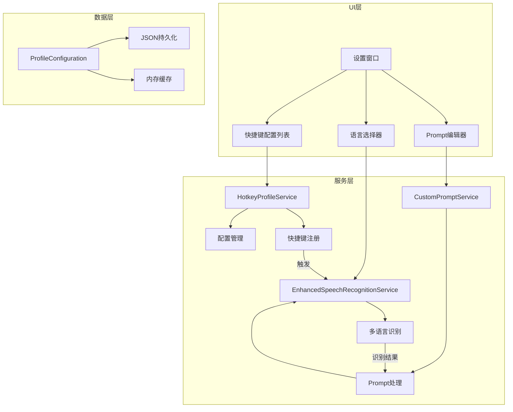
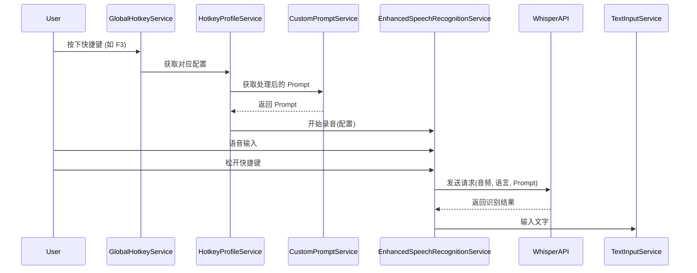

# 技术方案设计 - 自定义 Prompt 处理功能

## 系统架构



## 技术栈

- **现有技术栈**：C# 9.0 + WPF (.NET Core 3.1)
- **新增组件**：
  - Newtonsoft.Json：配置文件序列化
  - Microsoft.Extensions.Configuration：配置管理增强

## 核心设计

### 1. 数据模型设计

```csharp
// 快捷键配置文件
public class HotkeyProfile
{
    public string Id { get; set; }
    public string Name { get; set; }
    public string Hotkey { get; set; }  // 如 "F2", "Ctrl+F3"
    public string InputLanguage { get; set; }  // 如 "zh-CN", "en-US", "mixed"
    public string OutputLanguage { get; set; }  // 如 "zh-CN", "en-US", "ja-JP"
    public string CustomPrompt { get; set; }
    public bool IsDefault { get; set; }
    public bool IsEnabled { get; set; }
    public DateTime CreatedAt { get; set; }
    public DateTime UpdatedAt { get; set; }
}

// 配置集合
public class ProfileConfiguration
{
    public List<HotkeyProfile> Profiles { get; set; }
    public string ActiveProfileId { get; set; }
    public int Version { get; set; }
}
```

### 2. 服务层设计

#### HotkeyProfileService
负责管理所有快捷键配置：
- 加载/保存配置文件
- 注册/注销全局快捷键
- 处理快捷键冲突检测
- 维护配置状态

#### CustomPromptService
负责处理 Prompt 相关逻辑：
- Prompt 模板管理
- Prompt 变量替换（如 {input_language}, {output_language}）
- Prompt 验证
- 默认 Prompt 生成

#### EnhancedSpeechRecognitionService
扩展现有的 SpeechRecognitionService：
- 支持动态语言切换
- 集成自定义 Prompt
- 处理多语言转换逻辑

### 3. 配置存储设计

配置文件路径：`%LOCALAPPDATA%\SPEXT\profiles.json`

```json
{
  "version": 1,
  "profiles": [
    {
      "id": "default-zh-zh",
      "name": "中文输入输出",
      "hotkey": "F2",
      "inputLanguage": "zh-CN",
      "outputLanguage": "zh-CN",
      "customPrompt": "请将语音转换为简体中文文字。支持中英文混合输入。",
      "isDefault": true,
      "isEnabled": true
    },
    {
      "id": "custom-zh-en",
      "name": "中文输入英文输出",
      "hotkey": "F3",
      "inputLanguage": "zh-CN",
      "outputLanguage": "en-US",
      "customPrompt": "请将中文语音翻译为英文。保持专业术语的准确性。",
      "isDefault": true,
      "isEnabled": true
    }
  ]
}
```

### 4. UI 设计

在现有设置窗口中新增 Tab 页面：

```
设置窗口
├── 基础设置 (现有)
├── 快捷键配置 (新增)
│   ├── 配置列表 (DataGrid)
│   │   ├── 名称
│   │   ├── 快捷键
│   │   ├── 输入语言
│   │   ├── 输出语言
│   │   ├── 状态
│   │   └── 操作按钮
│   ├── 添加配置按钮
│   ├── 导入/导出按钮
│   └── 恢复默认按钮
└── 高级设置 (现有)
```

### 5. API 集成设计

扩展 Whisper API 调用：

```csharp
public class WhisperRequest
{
    public string Model { get; set; }
    public string Language { get; set; }  // 输入语言
    public string Prompt { get; set; }    // 自定义 Prompt
    public float Temperature { get; set; }
    public string ResponseFormat { get; set; }
}
```

### 6. 热键处理流程



## 测试策略

1. **单元测试**
   - HotkeyProfile 数据模型验证
   - 配置文件读写测试
   - Prompt 模板处理测试
   - 快捷键冲突检测测试

2. **集成测试**
   - 多快捷键注册和切换测试
   - 不同语言组合的识别测试
   - 配置导入导出测试

3. **UI 测试**
   - 配置列表的增删改查
   - Prompt 编辑器功能
   - 快捷键设置和验证

## 安全性考虑

1. **Prompt 注入防护**
   - 限制 Prompt 长度（最大 500 字符）
   - 过滤特殊字符
   - 验证 Prompt 内容合法性

2. **配置文件安全**
   - 配置文件权限控制
   - 敏感信息加密存储
   - 配置文件完整性校验

3. **快捷键安全**
   - 防止系统关键快捷键覆盖
   - 限制可用快捷键范围

## 性能优化

1. **配置缓存**
   - 内存中缓存活跃配置
   - 懒加载非活跃配置

2. **快捷键响应**
   - 预加载常用配置的 Prompt
   - 优化快捷键切换延迟

3. **API 调用优化**
   - 复用 HTTP 连接
   - 并发请求限制

## 向后兼容性

1. **配置迁移**
   - 检测旧版本配置
   - 自动迁移到新格式
   - 保留原始快捷键设置

2. **功能降级**
   - 单快捷键模式兼容
   - 默认 Prompt 回退机制