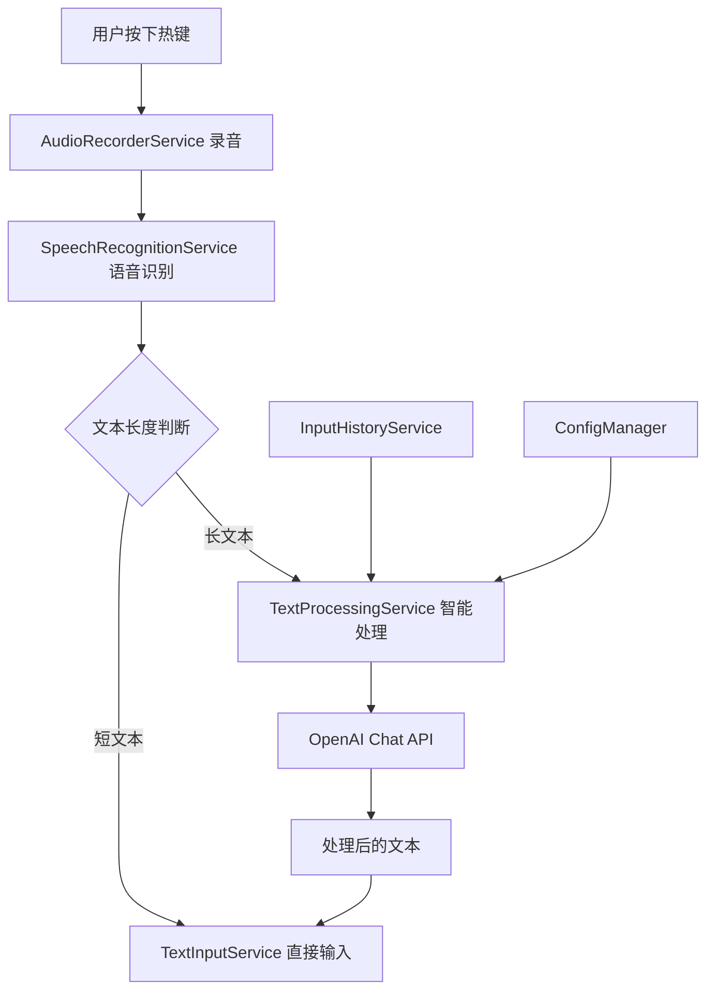

# 技术方案设计

## 架构概述

智能编辑功能将在现有的语音识别流程基础上增加一个文本后处理层。系统将根据文本长度和用户配置决定是否调用 OpenAI Chat API 进行智能处理。

### 系统架构图



## 技术栈

- **现有技术栈**：C# 9.0, WPF, .NET Core 3.1
- **新增依赖**：无需新增 NuGet 包，复用现有的 HttpClient 和 Newtonsoft.Json

## 核心组件设计

### 1. TextProcessingService（新增）

负责文本的智能处理逻辑。

**主要职责**：
- 判断文本是否需要处理
- 调用 OpenAI Chat API
- 管理处理超时和错误降级
- 应用用户自定义 Prompt

**关键方法**：
```csharp
public interface ITextProcessingService
{
    Task<string> ProcessTextAsync(string inputText);
    bool ShouldProcessText(string text);
    void UpdatePromptTemplate(string template);
}
```

### 2. InputHistoryService（新增）

管理用户的输入历史记录。

**主要职责**：
- 存储最近的输入历史
- 提供历史记录查询
- 实现 FIFO 策略
- 提供清除历史功能

**关键方法**：
```csharp
public interface IInputHistoryService
{
    void AddToHistory(string text);
    List<string> GetRecentHistory(int count);
    void ClearHistory();
    string GetContextForProcessing();
}
```

### 3. VoiceInputController（修改）

在现有的语音识别流程中集成智能编辑功能。

**修改内容**：
- 在 `OnRecordingCompleted` 方法中增加文本处理逻辑
- 注入 TextProcessingService 和 InputHistoryService

### 4. ConfigManager（扩展）

添加智能编辑相关的配置项。

**新增配置项**：
```json
{
  "VoiceInput": {
    "SmartEditing": {
      "Enabled": true,
      "TextLengthThreshold": 10,
      "CustomPrompt": "",
      "PromptTemplate": "default",
      "EnableContext": false,
      "HistoryCount": 5,
      "ChatModel": "gpt-3.5-turbo",
      "ChatApiUrl": "https://api.openai.com/v1/chat/completions",
      "ProcessingTimeout": 5
    }
  }
}
```

## API 集成设计

### OpenAI Chat API 调用

使用 Chat Completions API 替代传统的 Completions API，以获得更好的控制和效果。

**请求格式**：
```json
{
  "model": "gpt-3.5-turbo",
  "messages": [
    {
      "role": "system",
      "content": "你是一个文本编辑助手..."
    },
    {
      "role": "user",
      "content": "需要处理的文本"
    }
  ],
  "temperature": 0.3,
  "max_tokens": 500
}
```

### 默认 Prompt 模板

1. **标点符号优化**（默认）：
   ```
   请为以下文本添加适当的标点符号，修正明显的错别字，保持原意不变。只返回处理后的文本，不要添加任何解释。
   ```

2. **繁简转换**：
   ```
   将以下文本转换为简体中文，并添加适当的标点符号。只返回转换后的文本。
   ```

3. **专业纠正**：
   ```
   修正以下文本中的专业术语拼写和语法错误，确保技术术语的准确性。只返回修正后的文本。
   ```

## 数据流设计

1. **无上下文处理流程**：
   ```
   语音识别结果 -> 长度判断 -> API 处理 -> 输入文本
   ```

2. **带上下文处理流程**：
   ```
   语音识别结果 -> 获取历史记录 -> 构建上下文 -> API 处理 -> 保存到历史 -> 输入文本
   ```

## UI 设计更新

### SettingsWindow.xaml 修改

在现有的设置窗口中添加"智能编辑"选项卡：

```xml
<TabItem Header="智能编辑">
    <StackPanel>
        <CheckBox Name="EnableSmartEditing" Content="启用智能编辑"/>
        <TextBlock Text="文本长度阈值："/>
        <TextBox Name="TextLengthThreshold"/>
        <ComboBox Name="PromptTemplate">
            <ComboBoxItem>标点符号优化</ComboBoxItem>
            <ComboBoxItem>繁简转换</ComboBoxItem>
            <ComboBoxItem>专业纠正</ComboBoxItem>
            <ComboBoxItem>自定义</ComboBoxItem>
        </ComboBox>
        <TextBox Name="CustomPrompt" TextWrapping="Wrap" Height="100"/>
        <CheckBox Name="EnableContext" Content="启用上下文功能"/>
        <Button Name="ClearHistory" Content="清除历史记录"/>
    </StackPanel>
</TabItem>
```

## 错误处理和降级策略

1. **API 调用失败**：立即降级到原始文本输入
2. **处理超时**：超过配置的超时时间后取消请求，使用原始文本
3. **配额限制**：捕获 429 错误，提示用户并降级
4. **网络问题**：使用现有的代理配置，失败时降级

## 测试策略

### 单元测试

1. TextProcessingService 的文本长度判断逻辑
2. InputHistoryService 的 FIFO 实现
3. Prompt 模板的应用逻辑

### 集成测试

1. 完整的语音输入到智能编辑流程
2. API 调用的错误处理和降级
3. 配置更改的实时生效

### 手动测试场景

1. 短文本输入（不触发处理）
2. 长文本输入（触发处理）
3. 自定义 Prompt 测试
4. 上下文功能测试
5. API 失败降级测试
6. 超时处理测试

## 安全性考虑

1. **API 密钥**：复用现有的安全存储机制
2. **用户隐私**：输入历史仅保存在内存中，不持久化
3. **API 调用**：不发送任何用户标识信息
4. **错误信息**：不在日志中记录敏感内容

## 性能优化

1. **异步处理**：所有 API 调用使用异步方法
2. **超时控制**：严格的超时设置防止阻塞
3. **并发控制**：防止重复的 API 调用
4. **缓存机制**：对于相同的输入短期内返回缓存结果（可选）

## 部署和配置

1. 新功能默认关闭，需要用户主动启用
2. 配置文件向后兼容，旧版本配置文件可以正常升级
3. 所有新增配置项都有合理的默认值