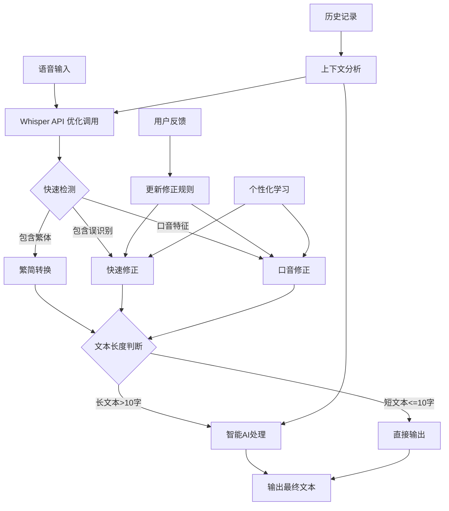

# 语音识别优化方案

## 背景

在实际使用中发现 Whisper API 存在以下识别问题：
1. **繁简体混淆**：用户说简体中文，但有时会识别为繁体中文
2. **英文术语误识别**：如 "US DOLLAR" 被识别为 "到"
3. **标点符号缺失**：语音停顿未能正确转换为书面标点符号
4. **口音导致的误识别**：非标准普通话口音导致的音近词错误

## 问题分析

### 1. 繁简体混淆问题

**根本原因**：
- Whisper 模型训练时包含了繁体和简体中文数据
- 模型会根据音频特征自行判断，有时会误判
- 当前实现仅指定语言为 "zh"，未明确区分简体/繁体

### 2. 英文术语误识别

**典型案例**：
```
原始语音：它这个正版的话有三种额度 20 dollar 一个月的 100 dollar 一个月的
识别结果：它这个正版的话有三种额度 20到一个月的 100到一个月的
```

**问题分析**：
- 中英混合场景下的音频特征相似性
- 缺少上下文提示
- 模型对专业术语的识别不足

### 3. 口音导致的音近词误识别

**典型案例**：
```
案例1：
原始语音：补充case
识别结果：補充Keys

案例2：
原始语音：不过任何可以锻炼自己开发能力的都是可以做的
识别结果：不过任何可以锻炼自己开放能力的都是可以做的

案例3：
原始语音：专票就更不行了，专票要三个点的税
识别结果1：装不下就更不行了 装不下要三个点的税
识别结果2：转票要三个点的税嘞
```

**问题分析**：
- 非标准普通话发音导致的音素混淆
- "case" 的发音可能被识别为 "keys"
- "开发" 的 "发" 音可能不够清晰，被识别为 "放"
- "专票"（zhuān piào）被识别为"装不下"（zhuāng bù xià），声母韵母相近
- 专业术语在日常语境下被误解为常用词组
- 方言口音或个人发音习惯的影响
- 语速过快导致的音节融合

## 解决方案

### 方案一：Whisper API 层面优化

#### 1. 增强语言指定
```csharp
// 修改 SpeechRecognitionService.cs
if (!string.IsNullOrEmpty(_configManager.WhisperLanguage) && _configManager.WhisperLanguage != "auto")
{
    // 如果是中文，明确指定简体
    string language = _configManager.WhisperLanguage;
    if (language == "zh") language = "zh-CN";
    formData.Add(new StringContent(language), "language");
}
```

#### 2. 添加 Prompt 引导
```csharp
// 添加 prompt 参数来引导模型
if (_configManager.WhisperLanguage == "zh" || _configManager.WhisperLanguage == "zh-CN")
{
    string promptText = "使用简体中文记录。支持中英文混合输入，包含金额、货币单位等专业术语。";
    formData.Add(new StringContent(promptText), "prompt");
}

// 降低随机性，提高准确性
formData.Add(new StringContent("0"), "temperature");
```

### 方案二：快速后处理层（轻量级）

#### 1. 繁简转换服务
```csharp
public class TextNormalizationService
{
    // 常见繁简字对照表
    private static readonly Dictionary<char, char> TraditionalToSimplified = new()
    {
        { '爲', '为' }, { '來', '来' }, { '個', '个' },
        { '們', '们' }, { '時', '时' }, { '會', '会' },
        { '說', '说' }, { '這', '这' }, { '裡', '里' },
        { '後', '后' }, { '過', '过' }, { '還', '还' },
        { '對', '对' }, { '將', '将' }, { '國', '国' },
        { '學', '学' }, { '開', '开' }, { '關', '关' },
        { '門', '门' }, { '見', '见' }, { '電', '电' },
        { '號', '号' }, { '車', '车' }, { '書', '书' },
        // ... 更多对照
    };
    
    public string NormalizeToSimplified(string text)
    {
        if (string.IsNullOrEmpty(text)) return text;
        
        var sb = new StringBuilder(text.Length);
        foreach (char c in text)
        {
            sb.Append(TraditionalToSimplified.TryGetValue(c, out char simplified) ? simplified : c);
        }
        return sb.ToString();
    }
}
```

#### 2. 常见误识别修正
```csharp
public class QuickFixService
{
    // 基于上下文的智能替换
    public string ApplyQuickFixes(string text)
    {
        // 检测数字+误识别模式
        var patterns = new Dictionary<string, string>
        {
            @"(\d+)\s*到\s*一个月" => "$1 dollar一个月",
            @"(\d+)\s*到\s*每月" => "$1 dollar每月",
            @"油爱死" => "US",
            @"人民币" => "RMB"
        };
        
        foreach (var pattern in patterns)
        {
            text = Regex.Replace(text, pattern.Key, pattern.Value);
        }
        
        return text;
    }
    
    // 音近词修正（需要更复杂的处理）
    public string FixPhoneticErrors(string text)
    {
        // 常见音近词误识别映射
        var phoneticFixes = new Dictionary<string, string>
        {
            { "成績是翻譯", "沉浸式翻译" },
            { "成绩是翻译", "沉浸式翻译" },
            { "工寫", "公司" },
            { "搜歌", "Sora" },
            { "開皮踢", "GPT" },
            { "補充Keys", "补充case" },
            { "补充Keys", "补充case" },
            { "开放能力", "开发能力" },  // 在编程语境下
            { "開放能力", "开发能力" },
            { "装不下", "专票" },  // 在税务语境下
            { "转票", "专票" }  // 在税务语境下
        };
        
        // 基于上下文的智能修正
        if (text.Contains("锻炼") && text.Contains("开放能力"))
        {
            text = text.Replace("开放能力", "开发能力");
        }
        
        // 财务/税务语境判断
        if ((text.Contains("税") || text.Contains("点") || text.Contains("发票")) 
            && (text.Contains("装不下") || text.Contains("转票")))
        {
            text = text.Replace("装不下", "专票").Replace("转票", "专票");
        }
        
        foreach (var fix in phoneticFixes)
        {
            text = text.Replace(fix.Key, fix.Value);
        }
        
        return text;
    }
}
```

### 方案三：智能处理增强

#### 1. 增强的 Prompt 模板
```csharp
public const string EnhancedChinesePrompt = @"
请对以下文本进行处理：
1. 将所有繁体字转换为简体字（重要：用户说的是简体中文，任何繁体字都是误识别）
2. 识别并修正货币相关的误识别（如'到'可能是'dollar'、'油爱死'可能是'US'）
3. 修正音近词误识别（如'成绩是翻译'可能是'沉浸式翻译'、'工写'可能是'公司'、'Keys'可能是'case'）
4. 在技术/编程语境下，'开放能力'应修正为'开发能力'
5. 在财务/税务语境下，'装不下'或'转票'可能是'专票'（专用发票）
6. 根据语义添加合适的标点符号（逗号、句号等）
7. 保持数字和单位的正确格式（如 $20、20美元）
8. 处理中英文混合的专业术语和产品名称

原文：{0}

只返回处理后的文本，不要解释。";
```

#### 2. 上下文感知处理
```csharp
public class ContextAwareProcessor
{
    private readonly List<string> _recentInputs = new();
    private Dictionary<string, string> _userDictionary = new();
    
    public void LearnFromCorrection(string original, string corrected)
    {
        // 学习用户的修正模式
        var differences = FindDifferences(original, corrected);
        foreach (var diff in differences)
        {
            _userDictionary[diff.Original] = diff.Corrected;
        }
    }
    
    public string BuildContextualPrompt(string currentText)
    {
        var context = string.Join("\n", _recentInputs.TakeLast(3));
        return $"基于以下上下文：\n{context}\n\n请处理新输入：{currentText}";
    }
}
```

### 方案四：个性化学习机制

```csharp
public class PersonalizedLearningService
{
    private Dictionary<string, string> _userCorrections = new();
    
    // 学习用户的修正模式
    public void LearnFromUserCorrection(string original, string corrected)
    {
        // 分析差异
        var differences = ExtractDifferences(original, corrected);
        foreach (var diff in differences)
        {
            // 记录用户的修正偏好
            _userCorrections[diff.From] = diff.To;
        }
    }
    
    // 应用个性化修正
    public string ApplyPersonalizedFixes(string text)
    {
        foreach (var correction in _userCorrections)
        {
            text = text.Replace(correction.Key, correction.Value);
        }
        return text;
    }
}
```

### 方案五：完整处理流程



## 实施计划

### 第一阶段：立即改进（1天）
1. 修改 Whisper API 调用，添加 prompt 和 temperature 参数
2. 将语言参数从 "zh" 改为 "zh-CN"
3. 实现基础的繁简字符转换

### 第二阶段：快速修正（2天）
1. 实现 TextNormalizationService
2. 实现 QuickFixService
3. 集成到现有流程中

### 第三阶段：智能优化（3-4天）
1. 更新智能编辑的 Prompt 模板
2. 实现上下文感知处理
3. 添加用户反馈学习机制

## 配置建议

```json
{
  "VoiceInput": {
    "WhisperAdvanced": {
      "Language": "zh-CN",              // 明确指定简体中文
      "Prompt": "使用简体中文记录。支持中英文混合输入。",
      "Temperature": 0.0                // 降低随机性
    },
    "TextNormalization": {
      "ForceSimplifiedChinese": true,  // 强制简体
      "AutoFixCommonErrors": true,     // 自动修正常见错误
      "EnableQuickFixes": true          // 启用快速修正
    },
    "SmartEditing": {
      "EnhancedPromptTemplate": "chinese_enhanced",  // 使用增强模板
      "LearnFromCorrections": true      // 从用户修正中学习
    }
  }
}
```

## 预期效果

1. **繁简体问题**：通过三层防护，基本消除繁体字出现
2. **专业术语**：通过 prompt 引导和快速修正，提高识别准确率
3. **标点符号**：通过智能处理，自动添加合适的标点
4. **整体体验**：减少用户手动修正的需求，提高输入效率

## 测试用例

1. **繁简体测试**：
   - 输入：「這個時候我們會說」
   - 期望：「这个时候我们会说」

2. **货币单位测试**：
   - 输入：「20到一个月」（在数字语境下）
   - 期望：「20 dollar一个月」

3. **混合场景测试**：
   - 输入：「這個正版的話有三種額度20到一個月的」
   - 期望：「这个正版的话有三种额度，20 dollar一个月的」

4. **音近词误识别测试**：
   - 输入：「現在就有的 那個成績是翻譯」
   - 实际想说：「现在就有的，那个沉浸式翻译」
   - 问题分析：
     - 繁体字："現在" -> "现在"，"個" -> "个"
     - 音近误识别："成績是翻譯" -> "沉浸式翻译"
     - 缺少标点符号

5. **口音导致的误识别测试**：
   - 案例1：
     - 输入：「補充Keys」
     - 期望：「补充case」
   - 案例2：
     - 输入：「不过任何可以锻炼自己开放能力的都是可以做的」
     - 期望：「不过任何可以锻炼自己开发能力的都是可以做的」
   - 案例3（财务语境）：
     - 输入：「装不下就更不行了 装不下要三个点的税」
     - 期望：「专票就更不行了，专票要三个点的税」
     - 变体：「转票要三个点的税嘞」→「专票要三个点的税」

## 后续优化方向

1. **个性化词典**：允许用户自定义常用词汇的修正规则
2. **领域适配**：根据用户使用场景（技术、金融、医疗等）选择不同的处理策略
3. **离线处理**：对于简单的繁简转换，可以完全在本地处理，提高响应速度
4. **模型微调**：收集足够数据后，可以考虑微调专门的模型
5. **口音适配**：
   - 收集不同口音的误识别模式
   - 建立口音特征到修正规则的映射
   - 提供用户个性化的发音习惯学习