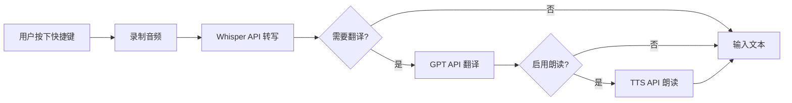

# TTS 朗读功能技术方案设计

## 架构概述

朗读功能将作为一个新的服务模块集成到现有的 SPEXT 系统中，遵循现有的服务架构模式。整体工作流程为：语音录制 → 转写 → 翻译 → 朗读 → 文本输入。



## 技术栈

- **语言框架**：C# 9.0 + .NET Core 3.1
- **音频播放**：NAudio 2.2.1（复用现有依赖）
- **TTS API**：OpenAI Audio API (tts-1/tts-1-hd)
- **配置存储**：JSON + Windows 凭据管理器
- **异步处理**：Task + CancellationToken

## 核心组件设计

### 1. 数据模型扩展

#### HotkeyProfile 扩展
```csharp
public class HotkeyProfile
{
    // 现有字段...
    
    // 新增朗读相关字段
    public bool EnableReadAloud { get; set; } = false;
    public string? ReadAloudVoice { get; set; } = "auto";
    
    // 计算属性：是否可以启用朗读
    public bool CanEnableReadAloud => IsTranslationEnabled;
}
```

#### TTS 配置模型
```csharp
public class TtsSettings
{
    public bool UseOpenAIConfig { get; set; } = true;
    public string? CustomApiKey { get; set; }
    public string? CustomApiUrl { get; set; }
    public string Model { get; set; } = "tts-1";
    public double Speed { get; set; } = 1.0;
    public int Volume { get; set; } = 80;
    public Dictionary<string, string> VoiceMapping { get; set; }
}
```

### 2. 服务层设计

#### ITextToSpeechService 接口
```csharp
public interface ITextToSpeechService
{
    Task<bool> SpeakAsync(string text, string language, CancellationToken cancellationToken = default);
    void StopSpeaking();
    bool IsSpeaking { get; }
    event EventHandler<string>? SpeakingCompleted;
    event EventHandler<Exception>? SpeakingFailed;
}
```

#### TextToSpeechService 实现
主要功能：
- 调用 OpenAI TTS API 获取音频流
- 使用 NAudio 播放音频
- 支持中断播放
- 根据语言自动选择语音
- 异步非阻塞执行

### 3. API 集成

#### OpenAI TTS API 调用
```csharp
// API 端点：https://api.openai.com/v1/audio/speech
// 请求格式
{
    "model": "tts-1",
    "input": "要朗读的文本",
    "voice": "alloy|echo|fable|onyx|nova|shimmer",
    "response_format": "mp3",
    "speed": 1.0
}
```

#### 语音映射策略
```json
{
    "zh": "nova",     // 中文 - 女声
    "en": "echo",     // 英文 - 男声
    "ja": "alloy",    // 日文 - 中性声
    "default": "nova"
}
```

### 4. 配置管理扩展

#### appsettings.json 结构
```json
{
  "VoiceInput": {
    "WhisperAPI": { ... },
    "GPTAPI": { ... },
    "TtsAPI": {
      "UseOpenAIConfig": true,
      "Model": "tts-1",
      "Speed": 1.0,
      "Volume": 80,
      "VoiceMapping": {
        "zh": "nova",
        "en": "echo",
        "ja": "alloy",
        "default": "nova"
      }
    }
  }
}
```

### 5. UI 组件设计

#### 快捷键编辑对话框扩展
- 在翻译设置区域下方添加"朗读设置"分组
- 包含"启用朗读"复选框
- 语音选择下拉框（自动/具体语音）

#### TTS 设置页面
- 新增独立的 TTS 设置页面
- 支持 API 配置
- 全局参数调整（速度、音量）
- 语音映射配置

## 关键技术实现

### 1. 音频播放管理
```csharp
private WaveOutEvent? _waveOut;
private Mp3FileReader? _audioReader;
private CancellationTokenSource? _playbackCts;

public async Task PlayAudioStreamAsync(Stream audioStream, CancellationToken cancellationToken)
{
    // 使用 NAudio 播放 MP3 流
    _audioReader = new Mp3FileReader(audioStream);
    _waveOut = new WaveOutEvent();
    _waveOut.Init(_audioReader);
    _waveOut.Volume = _volume / 100f;
    _waveOut.Play();
    
    // 等待播放完成或取消
    await WaitForPlaybackCompletionAsync(cancellationToken);
}
```

### 2. 中断机制
```csharp
public void StopSpeaking()
{
    _playbackCts?.Cancel();
    _waveOut?.Stop();
    _waveOut?.Dispose();
    _audioReader?.Dispose();
}
```

### 3. 文本预处理
```csharp
private string PreprocessText(string text)
{
    // 移除多余的标点符号
    text = Regex.Replace(text, @"[。，！？]{2,}", m => m.Value[0].ToString());
    
    // 移除特殊字符（保留基本标点）
    text = Regex.Replace(text, @"[^\w\s\u4e00-\u9fa5\u3040-\u309f\u30a0-\u30ff，。！？,.!?]", " ");
    
    // 修剪空白
    return text.Trim();
}
```

### 4. 错误处理策略
- API 调用失败：静默失败，记录日志
- 音频播放失败：触发 SpeakingFailed 事件
- 网络超时：使用较短的超时时间（5秒）
- 重试机制：最多重试 1 次

## 工作流集成

### 修改 EnhancedVoiceInputController
```csharp
private async Task ProcessRecordingAsync(byte[] audioData, HotkeyProfile profile)
{
    // 1. 转写
    var transcription = await _speechRecognitionService.RecognizeAsync(...);
    
    // 2. 翻译（如果需要）
    var finalText = transcription;
    if (profile.IsTranslationEnabled)
    {
        finalText = await _speechRecognitionService.TranslateAsync(...);
    }
    
    // 3. 输入文本
    _textInputService.TypeText(finalText);
    
    // 4. 朗读（如果启用）
    if (profile.EnableReadAloud && profile.IsTranslationEnabled)
    {
        _ = Task.Run(async () => 
        {
            await _ttsService.SpeakAsync(finalText, profile.OutputLanguage);
        });
    }
}
```

## 测试策略

### 单元测试
- TTS 服务的语音选择逻辑
- 文本预处理功能
- 配置加载和保存

### 集成测试
- API 调用和错误处理
- 音频播放和中断
- 完整工作流测试

### 手动测试场景
1. 各种语言的朗读效果
2. 长文本朗读和中断
3. 网络异常情况
4. 并发朗读请求

## 安全性考虑

1. **API 密钥安全**：复用现有的 SecureStorageService
2. **音频数据**：不缓存音频文件，直接从内存播放
3. **用户隐私**：朗读内容不记录日志
4. **资源管理**：确保音频资源正确释放

## 性能优化

1. **异步执行**：朗读不阻塞主线程
2. **流式处理**：直接播放音频流，不保存文件
3. **资源复用**：复用 HTTP 客户端实例
4. **内存管理**：及时释放音频资源

## 扩展性设计

1. **多 TTS 提供商**：接口设计支持未来添加其他 TTS 服务
2. **语音包管理**：预留语音包下载和管理接口
3. **高级音频处理**：预留音频效果处理扩展点