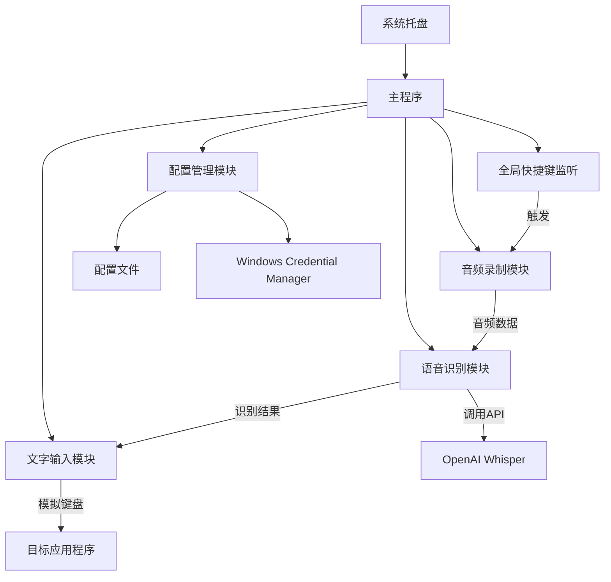

# 技术方案设计

## 架构概述

采用 Windows 原生应用架构，主程序作为后台服务运行，通过系统托盘与用户交互。



## 技术栈

- **开发语言**: C# 11 (.NET 8)
- **UI框架**: WPF (设置界面) + Windows Forms (系统托盘)
- **音频处理**: NAudio
- **全局快捷键**: Windows Hook API (通过 user32.dll)
- **API调用**: HttpClient + System.Text.Json
- **键盘模拟**: Windows Input Simulator / SendKeys
- **配置存储**: 
  - 普通配置：Application Settings
  - API密钥：Windows Credential Manager
- **打包工具**: 
  - 发布：dotnet publish (自包含单文件)
  - 安装程序：WiX Toolset / Inno Setup

## 核心模块设计

### 1. 主程序模块 (Program.cs)
- 程序入口，单实例检查
- 初始化依赖注入容器
- 管理应用程序生命周期
- 异常处理和日志记录

### 2. 系统托盘模块 (TrayIcon.cs)
- 使用 NotifyIcon 创建托盘图标
- 右键菜单（设置、退出）
- 状态提示（录音中、识别中）
- 气泡提示通知

### 3. 全局快捷键模块 (GlobalHotkey.cs)
- 使用 RegisterHotKey API 注册全局快捷键
- 低级键盘钩子监听按键状态
- 支持自定义快捷键组合
- KeyDown 开始录音，KeyUp 停止录音

### 4. 音频录制模块 (AudioRecorder.cs)
- 使用 NAudio 的 WaveInEvent 录制音频
- 配置：16kHz 采样率，16位，单声道
- 内存流缓存音频数据
- 实时音量检测（可选）

### 5. 语音识别模块 (SpeechRecognition.cs)
- 使用 HttpClient 调用 OpenAI Whisper API
- 音频格式转换（WAV）
- 异步处理，不阻塞UI
- 错误处理和重试机制

### 6. 文字输入模块 (TextInput.cs)
- 使用 InputSimulator 模拟键盘输入
- 支持 Unicode 字符输入
- 检测当前焦点窗口
- 剪贴板备选方案

### 7. 配置管理模块 (ConfigManager.cs)
- 使用 IConfiguration 管理配置
- 普通设置存储在 appsettings.json
- API密钥存储在 Windows Credential Manager
- 支持热重载配置

### 8. 设置界面模块 (SettingsWindow.xaml)
- WPF MVVM 架构
- API密钥配置
- 快捷键自定义
- 开机启动选项
- 主题设置（可选）

## 数据流设计

1. 用户按下快捷键 → 开始录音
2. 音频数据实时缓存到内存
3. 用户松开快捷键 → 停止录音
4. 音频数据转换为 WAV 格式
5. 调用 Whisper API 进行识别
6. 获取识别结果
7. 模拟键盘输入文字

## API 设计

### OpenAI Whisper API 调用
```csharp
var formData = new MultipartFormDataContent();
formData.Add(new ByteArrayContent(audioData), "file", "audio.wav");
formData.Add(new StringContent("whisper-1"), "model");
// language 参数不传，实现自动检测
formData.Add(new StringContent("json"), "response_format");

// 请求头
request.Headers.Authorization = new AuthenticationHeaderValue("Bearer", apiKey);
```

## 安全性设计

1. **API密钥存储**: 
   - 使用 Windows Credential Manager API
   - 通过 CredentialManagement NuGet 包访问
   - 密钥不存储在配置文件中

2. **内存安全**: 
   - 使用 SecureString 处理敏感数据
   - 音频数据使用后立即 Dispose
   - 实现 IDisposable 模式

3. **网络安全**: 
   - 强制 TLS 1.2+
   - 证书验证
   - 请求超时设置

4. **权限控制**: 
   - UAC 清单设置为 asInvoker
   - 不需要管理员权限

## 测试策略

1. **单元测试**: 各模块独立测试
2. **集成测试**: 完整流程测试
3. **兼容性测试**: Windows 10/11 测试
4. **性能测试**: 长时间录音测试

## 部署方案

1. **发布配置**:
   ```xml
   <PublishSingleFile>true</PublishSingleFile>
   <SelfContained>true</SelfContained>
   <RuntimeIdentifier>win-x64</RuntimeIdentifier>
   <PublishReadyToRun>true</PublishReadyToRun>
   ```

2. **代码签名**: 
   - 使用 signtool.exe 进行数字签名
   - 时间戳服务器确保长期有效

3. **安装程序**: 
   - 使用 Inno Setup 创建安装程序
   - 注册开机启动项
   - 创建开始菜单快捷方式

4. **自动更新**: 
   - 使用 Squirrel.Windows（未来版本）

## 性能优化

1. **内存优化**:
   - 使用 ArrayPool<byte> 重用音频缓冲区
   - 及时释放大对象
   - 后台 GC 模式

2. **响应优化**:
   - 全局快捷键使用低级钩子，响应时间 < 50ms
   - API 调用使用 async/await
   - UI 更新使用 Dispatcher

3. **启动优化**:
   - 使用 ReadyToRun 编译
   - 延迟加载非关键程序集
   - 启动时间目标 < 1秒

4. **资源占用**:
   - 内存占用目标 < 50MB
   - CPU 空闲时 < 1%
   - 打包体积目标 < 15MB