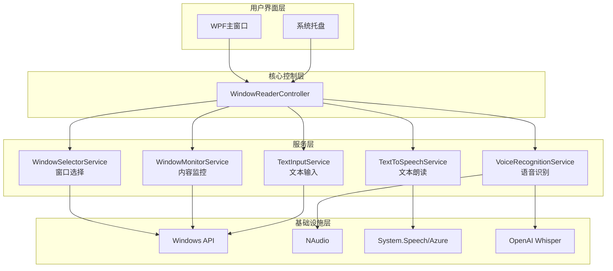
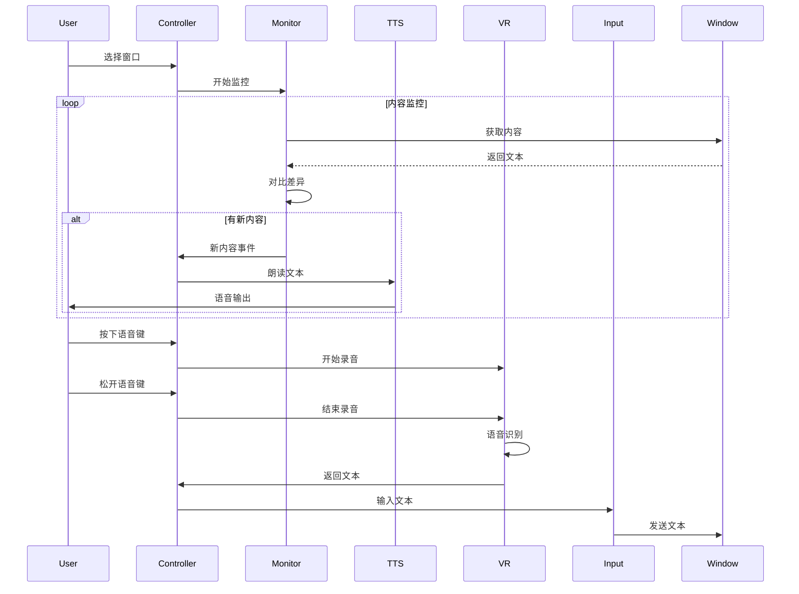

# 智能窗口朗读与语音交互工具技术方案设计

## 系统架构



## 技术栈

- **开发语言**: C# 9.0
- **UI框架**: WPF (.NET Core 3.1)
- **音频处理**: NAudio 2.2.1
- **语音识别**: OpenAI Whisper API (复用现有 VoiceInput 项目的实现)
- **文本朗读**: 
  - Windows内置: System.Speech.Synthesis
  - 可选升级: Azure Cognitive Services Speech SDK
- **窗口操作**: Windows API (user32.dll, UIAutomation)
- **依赖注入**: Microsoft.Extensions.DependencyInjection

## 核心组件设计

### 1. WindowSelectorService
- **功能**: 枚举和选择目标窗口
- **技术**: 
  - EnumWindows API 枚举所有顶层窗口
  - GetWindowText 获取窗口标题
  - 窗口截图预览功能
- **接口**:
  ```csharp
  public interface IWindowSelectorService
  {
      Task<IEnumerable<WindowInfo>> GetAvailableWindows();
      Task<bool> SelectWindow(IntPtr hWnd);
      IntPtr GetSelectedWindow();
  }
  ```

### 2. WindowMonitorService
- **功能**: 监控窗口内容变化
- **技术方案**:
  - **方案A (推荐)**: UI Automation API
    - 支持大多数标准Windows控件
    - 可获取结构化文本内容
    - 支持文本变化事件
  - **方案B**: OCR + 截图对比
    - 兼容性最好但性能较差
    - 适用于非标准控件
- **实现策略**:
  - 使用定时器轮询 (100ms间隔)
  - 缓存上次内容，对比获取增量
  - 智能去重和过滤

### 3. TextToSpeechService
- **功能**: 文本朗读with队列管理
- **实现**:
  ```csharp
  public interface ITextToSpeechService
  {
      Task SpeakAsync(string text);
      void StopSpeaking();
      void SetVoice(string voiceName);
      void SetRate(int rate); // -10 to 10
      void SetVolume(int volume); // 0 to 100
  }
  ```
- **特性**:
  - 朗读队列管理
  - 支持中断和跳过
  - 可配置语音参数

### 4. VoiceRecognitionService
- **功能**: 语音转文字（复用VoiceInput项目）
- **实现**: 直接引用现有的 AudioRecorderService 和 SpeechRecognitionService
- **流程**:
  1. 热键触发开始录音
  2. 松开热键结束录音
  3. 调用 Whisper API 转文字
  4. 返回识别结果

### 5. TextInputService
- **功能**: 将文字输入到目标窗口
- **技术**: 
  - SetForegroundWindow 激活窗口
  - SendMessage/PostMessage 发送文本
  - 备选: UI Automation 的 SetValue
- **注意事项**:
  - 处理不同输入法状态
  - 支持Unicode字符

## 数据流设计



## 配置设计

```json
{
  "WindowReader": {
    "Monitor": {
      "PollingInterval": 100,
      "MaxContentLength": 10000,
      "EnableSmartFilter": true
    },
    "TTS": {
      "Voice": "Microsoft Huihui Desktop",
      "Rate": 0,
      "Volume": 100,
      "QueueMode": "Append"
    },
    "VoiceInput": {
      "Hotkey": "F4",
      "MaxRecordingTime": 30,
      "Language": "zh-CN"
    },
    "Filters": {
      "IgnorePatterns": [
        "^\\s*$",
        "^-+$",
        "^=+$"
      ]
    }
  }
}
```

## 测试策略

1. **单元测试**
   - 服务层各组件的独立测试
   - Mock Windows API 调用

2. **集成测试**
   - 窗口监控准确性测试
   - 语音识别和输入端到端测试

3. **性能测试**
   - CPU和内存占用监控
   - 大量文本输出场景测试

4. **兼容性测试**
   - 不同类型窗口（CMD, PowerShell, Terminal, VS Code）
   - 不同Windows版本

## 安全性考虑

1. **权限管理**
   - 仅在用户明确选择的窗口上操作
   - 不存储窗口内容

2. **API密钥保护**
   - 复用 VoiceInput 的 SecureStorageService
   - 支持代理配置

3. **隐私保护**
   - 不记录朗读历史
   - 语音数据即用即删

## 部署方案

1. **打包方式**
   - 自包含单文件可执行程序
   - 包含所有依赖库

2. **安装需求**
   - Windows 10 1809 或更高版本
   - .NET Core 3.1 Runtime (自包含则不需要)
   - 麦克风权限

3. **更新机制**
   - 可选：自动更新检查
   - 手动下载更新包